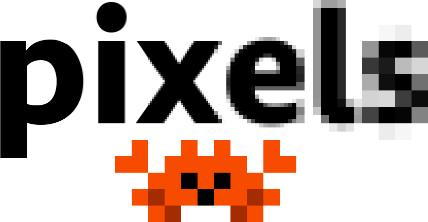

[](https://crates.io/crates/pixels "Crates.io version")
[](https://docs.rs/pixels "Documentation")
[](https://github.com/parasyte/pixels/actions "CI")
[](https://github.com/parasyte/pixels/commits "Commit activity")
[](https://github.com/sponsors/parasyte "Sponsors")



A tiny hardware-accelerated pixel frame buffer. 🦀

## But why?

Rapidly prototype a simple 2D game, pixel-based animations, software renderers, or an emulator for your favorite platform. Then add shaders to simulate a CRT or just to spice it up with some nice VFX.

`pixels` is more than just a library to push pixels to a screen, but less than a full framework. You're in charge of managing a window environment, event loop, and input handling.

## MSRV Policy

The Minimum Supported Rust Version for `pixels` will always be made available in the [MSRV.md](./MSRV.md) file on GitHub.

## Features

- Built on modern graphics APIs powered by [`wgpu`](https://crates.io/crates/wgpu): Vulkan, Metal, DirectX 12, OpenGL ES3.
    - DirectX 11, WebGL2, and WebGPU support are a work in progress.
- Use your own custom shaders for special effects.
- Hardware accelerated scaling on perfect pixel boundaries.
- Supports non-square pixel aspect ratios. (WIP)

## Examples

### Games 🎮

- [Conway's Game of Life](./examples/conway)
- [Pixel Invaders](./examples/invaders)

### Demos 🧪

- [Custom Shader](./examples/custom-shader)
- [Dear ImGui example with `winit`](./examples/imgui-winit)
- [Egui example with `winit`](./examples/minimal-egui)
- [Minimal example for WebGL2](./examples/minimal-web)
- [Minimal example with `winit`](./examples/minimal-winit)
- [Minimal example with `tao`](./examples/minimal-tao)
- [Minimal example with `fltk`](./examples/minimal-fltk)
- [`raqote` example](./examples/raqote-winit)
- [`tiny-skia` example](./examples/tiny-skia-winit)

## Troubleshooting

### Driver issues

The most common issue is having an outdated graphics driver installed on the host machine. `pixels`
requests a low power (aka integrated) GPU by default. If the examples are not working for any reason, you may try setting the `WGPU_POWER_PREF=high` environment variable to see if that addresses the issue on your host machine.

You should also try to keep your graphics drivers up-to-date, especially if you have an old Intel integrated GPU. Keep in mind that some drivers and GPUs are EOL and will not be supported.

### Logging

You may want to use the `RUST_LOG` environment variable (see [`env_logger`](https://docs.rs/env_logger) for full documentation) to gain additional insight while troubleshooting the examples. `RUST_LOG=trace` will spew all logs to `stderr` on debug builds:

```
$ RUST_LOG=trace cargo run --package minimal-winit
```

And also on release builds when default features are disabled:

```
$ RUST_LOG=trace cargo run --package minimal-winit --release --no-default-features
```

## Comparison with `minifb`

The [`minifb`](https://crates.io/crates/minifb) crate shares some similarities with `pixels`; it also allows rapid prototyping of 2D games and emulators. But it requires the use of its own window/GUI management, event loop, and input handling. One of the disadvantages with the `minifb` approach is the lack of hardware acceleration (except on macOS, which uses Metal but is not configurable). An advantage is that it relies on fewer dependencies.

## Comparison with `softbuffer`

There is a more recent project called [`softbuffer`](https://github.com/john01dav/softbuffer). It provides similar capabilities to what `pixels` offers, but is intentionally limited to software-only (not hardware-accelerated) rasterization.
