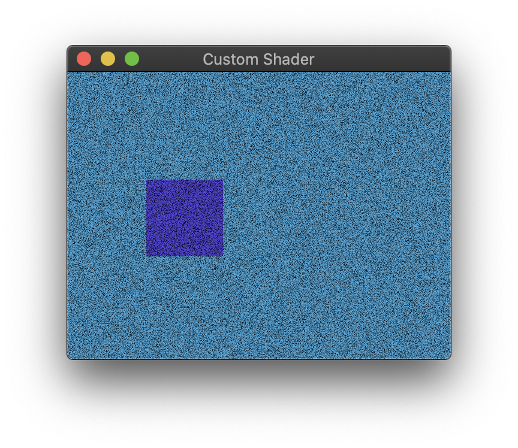

# Custom Shader Example



## Running

```bash
cargo run --release --package custom-shader
```

## About

This example is based on `minimal-winit`, and extends it with a custom renderer that adds white noise to the screen.
