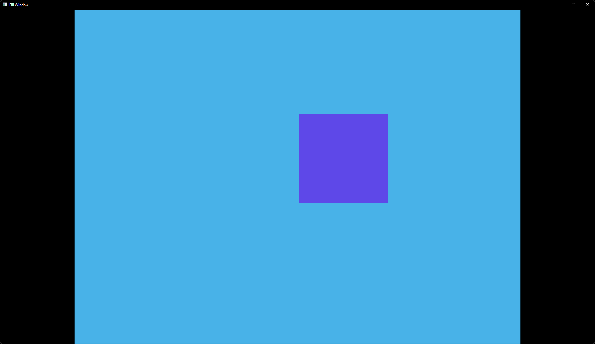

# Window-filling Example



## Running

```bash
cargo run --release --package fill-window
```

## About

This example is based on `minimal-winit` and `custom-shader`. It adds a custom renderer that completely fills the screen while maintaining high quality.

Filling the screen necessarily creates artifacts (aliasing) due to a mismatch between the number of pixels in the pixel buffer and the number of pixels on the screen. The custom renderer provided here counters this aliasing issue with a two-pass approach:

1. First the pixel buffer is scaled with the default scaling renderer, which keeps sharp pixel edges by only scaling to integer ratios with nearest neighbor texture filtering.
2. Then the custom renderer scales that result to the smallest non-integer multiple that will fill the screen without clipping, using bilinear texture filtering.

This approach maintains the aspect ratio in the second pass by adding black "letterbox" or "pillarbox" borders as necessary. The two-pass method completely avoids pixel shimmering with single-pass nearest neighbor filtering, and also avoids blurring with single-pass bilinear filtering. The result has decent quality even when scaled up 100x.
