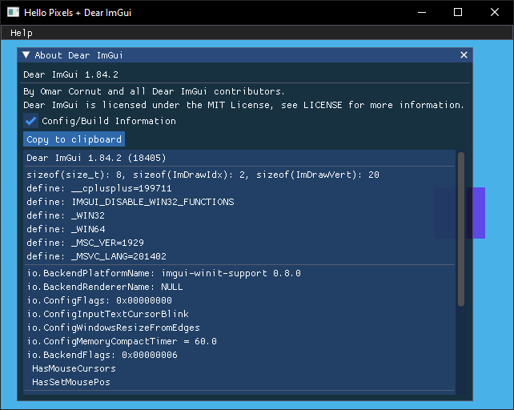

# Dear-ImGui Example



Minimal example with `imgui` and `winit`.

## Running

```bash
cargo run --release --package imgui-winit
```

## About

This example is based on `minimal-winit`, and extends it with `imgui` to render custom GUI elements over your pixel frame buffer.
