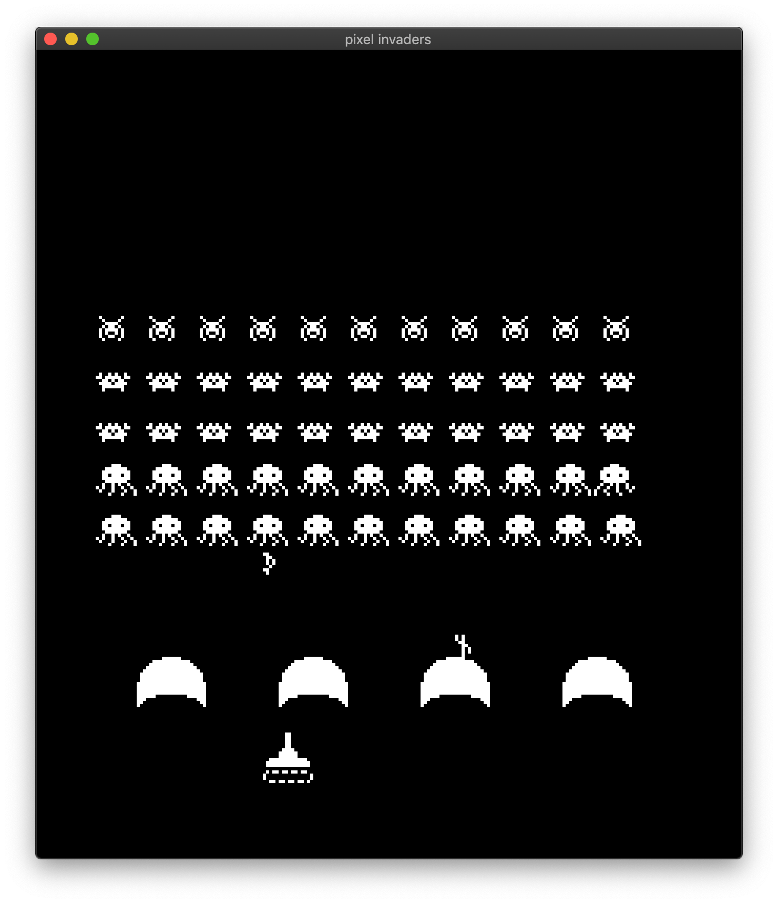

# Pixel Invaders 👾



The pixels have invaded!

## Running

```bash
cargo run --release --package invaders
```

## Keyboard Controls

<kbd>🡰</kbd> <kbd>🡲</kbd>: Move tank

<kbd>Space</kbd>: Fire cannon

<kbd>Pause</kbd> <kbd>P</kbd>: Pause

<kbd>R</kbd>: Reset Game

<kbd>escape</kbd>: Quit

## GamePad Controls

`D-Pad 🡰` `D-Pad 🡲`: Move tank

`XBox 🅐` `PS 🅧` `Switch 🅑`: Fire cannon

`XBox/PS ≡` `Switch ⊕︀`: Pause

## Goal

Shoot all of the invaders before they reach Earth and begin a hostile takeover. Be careful, because the entire fleet is coordinated and acts as a hive mind. Their aggression increases as their numbers dwindle.

## Architecture

Pixel Invaders uses the `simple-invaders` crate for all game logic and drawing. Be sure to check out that crate if you are interested in any of the inner workings of the game.

This example is simply glue code that uses `winit` for windowing/event handling and keyboard input. The `winit` event loop is used to drive the `simple-invaders` state and rasterize each frame. Finally, `pixels` takes the rasterized frame buffer and sends it to the screen, optionally through a series of render passes.
