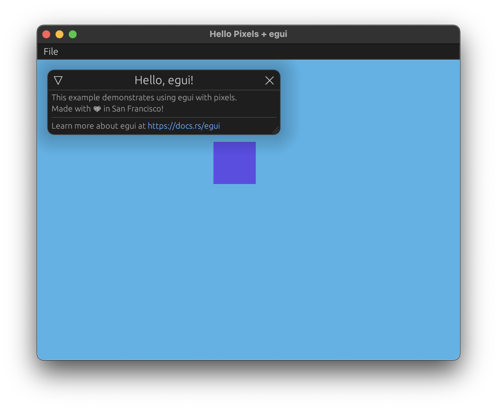

# Egui Example



Minimal example with `egui` and `winit`.

## Running

```bash
cargo run --release --package minimal-egui
```

## About

This example is based on `minimal-winit`, and extends it with `egui` to render custom GUI elements over your pixel frame buffer.
