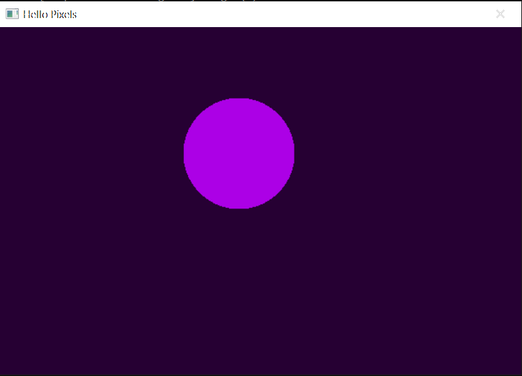

# Hello Pixels



Minimal example with fltk.

## Running

```bash
cargo run --release --package minimal-fltk
```

## About

This example demonstrates the absolute minimum for creating an fltk window and pixel buffer. It animates a purple circle moving on a darker purple background, just for _something_ interesting to display.
