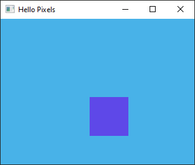

# Hello Pixels



Minimal example with SDL2 using `beryllium`.

## Running

```bash
cargo run --release --example minimal-sdl2 --features minimal-sdl2
```

## About

This example demonstrates the absolute minimum for creating an SDL2 window and pixel buffer. It animates a purple box moving on a blue background, just for _something_ interesting to display.

The example currently does not run on macOS. See #47 for details.
