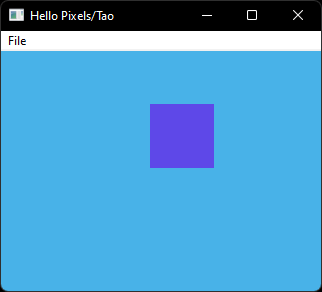

# Hello Pixels/Tao



Minimal example with `tao`.

## Running

```bash
cargo run --release --package minimal-tao
```

## About

This example is based on `minimal-winit`, using `tao` for window and event handling.

It adds a native menubar with a single "File > Quit" menu item to demonstrate simple functionality.
