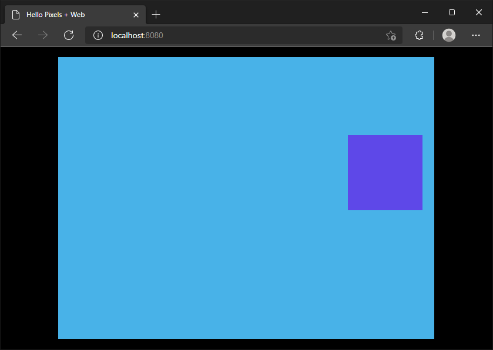

# Hello Pixels + Web



Minimal example with WebGL2.

## Install build dependencies

Install the WASM32 target and a few CLI tools:

```bash
rustup target add wasm32-unknown-unknown
cargo install --locked wasm-bindgen-cli just miniserve
```

## Running

Build the project and start a local server to host it:

```bash
just serve minimal-web
```

Open http://localhost:8080/ in your browser to run the example.

To build the project without serving it:

```bash
just build minimal-web
```

The build files are stored in `./target/minimal-web/`.

## About

This example is based on `minimal-winit`, demonstrating how to build your app for WebGL2 targets.
