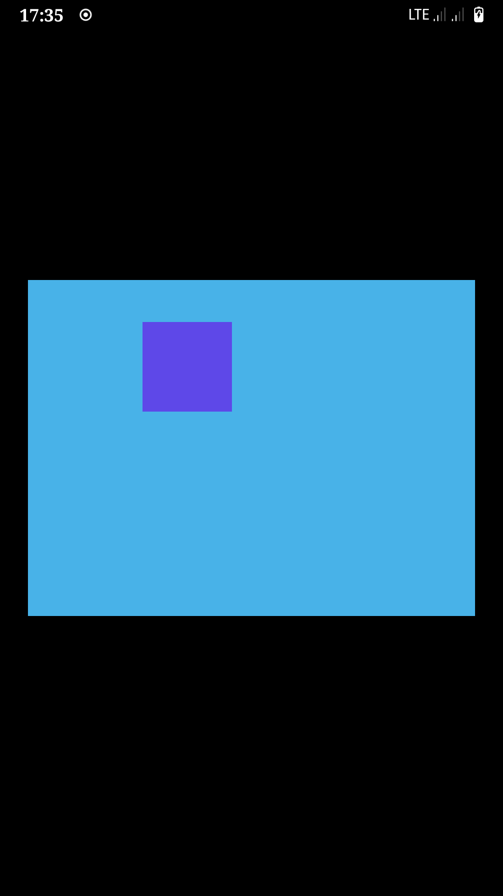

# Hello Android



Minimal example to run on android using `winit` with `android-native-activity` feature

## Running on Android

```bash
export ANDROID_HOME="path/to/sdk"
export ANDROID_NDK_HOME="path/to/ndk"

rustup target add aarch64-linux-android
cargo install cargo-apk
```

Connect your Android device via USB cable to your computer in debug mode and run the following command

```bash
cargo apk run --package minimal-winit-android
```

## Running on Desktop

Sometimes it is helpful to run your Android apps on a Desktop environment (e.g., Windows, macOS, or
Linux). It works the same way as all other `pixels` examples:

```bash
cargo run --package minimal-winit-android
```

## Containerized Builds

A `Containerfile` is included, allowing containerized builds without the need to install the Android
SDK and dependencies on the build host.

The following commands are assumed to be run from the repository root directory.

Build the image in Docker:

```bash
docker build -t rust-android:latest ./examples/minimal-winit-android/
```

Build the example in the container:

```bash
docker run --rm -it -v "$PWD:/src" rust-android:latest --package minimal-winit-android
```

The APKs are written to `./target/debug/apk/`.

For release builds, add `--release` to the end of the `run` command. (This will need the path to
the keystore corrected in the Cargo.toml manifest.) The APKs are written to `./target/release/apk/`.
