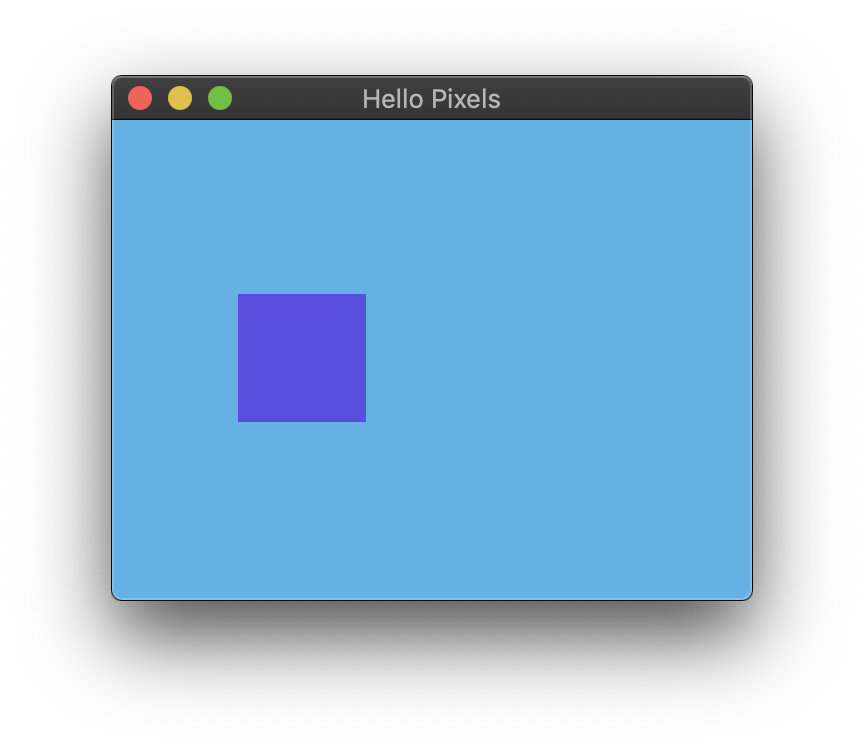

# Hello Pixels



Minimal example with `winit`.

## Running

```bash
cargo run --release --package minimal-winit
```

## About

This example demonstrates the absolute minimum for creating a `winit` window and pixel buffer. It animates a purple box moving on a blue background, just for _something_ interesting to display.

It uses `winit_input_helper` to provide a slightly better code presentation, but it doesn't greatly reduce the number of lines in the example.
