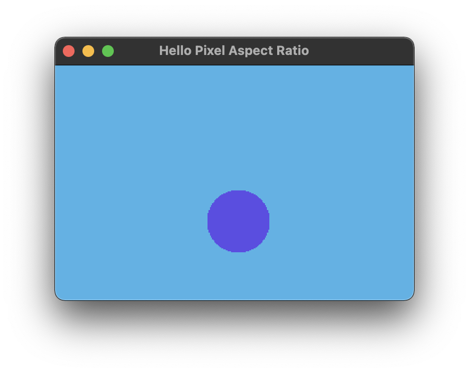
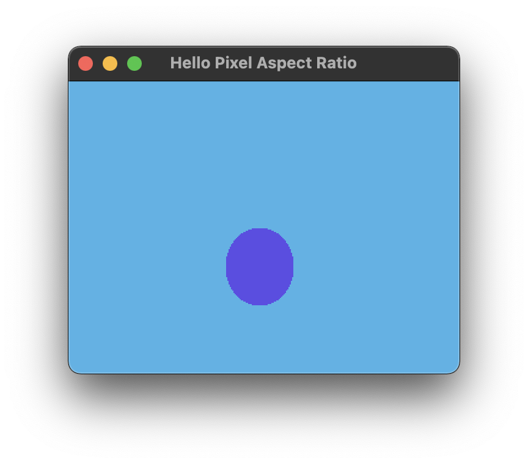

# Hello Pixel Aspect Ratio



## Running

```bash
cargo run --release --package pixel-aspect-ratio
```

## About

This example demonstrates pixel aspect ratio. PAR is similar to the common screen aspect ratio that many people are now familiar with (e.g. 16:9 wide screen displays), but applies to the ratio of a _pixel_'s width to its height. Pixel aspect ratios other than `1:1` are common on old computer and video game hardware that outputs NTSC or PAL video signals.

The screenshot above shows an ellipse with an `8:7` aspect ratio drawn on a pixel buffer with a matching pixel aspect ratio. In other words, it shows a circle! Below, the _same_ pixel buffer is rendered with a `1:1` pixel aspect ratio, which shows the actual distortion of the ellipse.



You might also take note that the window is slightly wider in the first image. This is ultimately what corrects the distortion and causes the ellipse to look like a circle.
